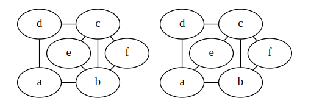
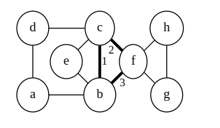
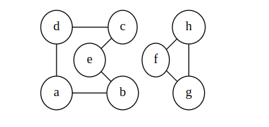
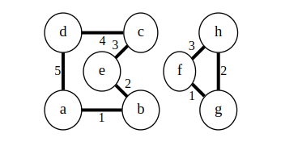
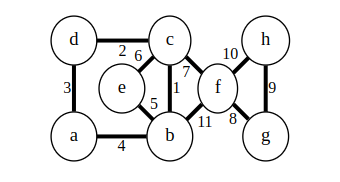
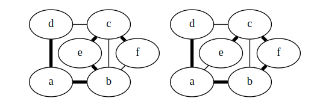
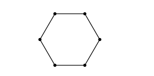
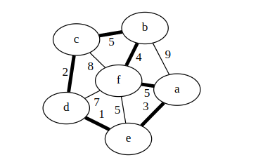

### Euler Paths and Circuits/Cycle

An **Euler circuit (or Eulerian circuit)** in a graph G is a simple circuit that contains every edge of G.
 - Reminder: a simple circuit doesn't use the same edge more than once.
 - So, a circuit around the graph passing by every edge exactly once.
 - We will allow simple or multigraphs for any of the Euler stuff.

Euler circuits are one of the oldest problems in graph theory.
 - People wanted to walk around the city of Königsberg and cross every bridge as they went.
 - and end up back at home.
 - The problem turns into one about graphs if you let each bridge be an edge and each island/land mass be a vertex.
 - And Euler solved it, so he gets his name on it.

In the modern world: you want to walk around the mall without missing any stores, or wasting time walking the same hall again.

For example, the first graph has an Euler circuit, but the second doesn't.
 
 

Note: you're allowed to use the same vertex multiple times, just not the same edge.

An Euler path (or Eulerian path) in a graph $G$ is a simple path that contains every edge of $G$.

 - The same as an Euler circuit, but we don't have to end up back at the beginning.
 - The other graph above does have an Euler path.

<strong>Theorem</strong>: A graph with an Eulerian circuit must be connected, and each vertex has even degree.

<strong>Proof</strong>: If it's not connected, there's no way to create a circuit.

When the Eulerian circuit arrives at an edge, it must also leave. This visits two edges on the vertex. When it returns to its starting point, it has visited an even number of edges at each vertex.

<strong>Theorem</strong>: A connected graph with even degree at each vertex has an Eulerian circuit.

<strong>Proof</strong>: We will show that a circuit exists by actually building it for a graph with |V|=n. For n=2, the graph must be two vertices connected by two edges. It has an Euler circuit.

For $n>2$, pick a vertex v as a starting point. Pick an arbitrary edge leaving v. Continue to pick edges and walk around the graph until you return to v. We know we'll never get stuck since every vertex has even degree: if we walk in, then there's a way to walk out.

This process forms part of our circuit. Let $E_{v}$ be the set of edges visited in our initial loop.

Consider the graph with edges $E−E_{v}$ and whatever vertices still have an edge adjacent. Each vertex in this graph has even degree (since we removed an even number from each) and it has less than $n$ edges. By strong induction, we can find an Euler circuit for each connected component of this graph.

Since our graph was connected originally, each of these sub-circuits shares a vertex with out $E_{v}$ walk. We can join these together at the shared vertex to form a circuit of all edges in G.

An example will help. Suppose we have the graph below start at b and find the initial walk highlighted.

That leaves us with this two-component graph to apply the inductive hypothesis to:

So we find a Euler circuit in each component:

We combine to form a Euler circuit of the original by following one of the component-circuits whenever we can:

***Corollary 1:*** A graph has an Eulerian circuit if and only if it is connected and all of its vertices have even degree.

***Corollary 2:*** A graph has an Eulerian path but no Eulerian circuit if and only if it has exactly two vertices with odd degree.

<strong>Proof:</strong>

If we add an edge between the two odd-degree vertices, the graph will have an Eulerian circuit. If we remove the edge, then what remains is an Eulerian path.

Suppose a graph with a different number of odd-degree vertices has an Eulerian path. Add an edge between the two ends of the path. This is a graph with an odd-degree vertex and a Euler circuit. As the above theorem shows, this is a contradiction.

The Euler circuit/path proofs imply an algorithm to find such a circuit/path.
 - It will take $\Theta(|E|)$ running time: we end up traversing each edge once in the "find random cycle" phase, and again when joining cycles. I don't think we can hope for better than that.

### Hamilton Paths and Circuits

The Euler circuits and paths wanted to use every edge exactly once.

It seems obvious to then ask: can we make a circuit of a graph using every vertex exactly once?
  - Such a circuit is a Hamilton circuit or Hamiltonian circuit.
  - Similarly, a path through each vertex that doesn't end where it started is a Hamilton path.

It seems like finding a Hamilton circuit (or conditions for one) should be more-or-less as easy as a Euler circuit.
 - Unfortunately, it's much harder.

For example, the two graphs above have Hamilton paths but not circuits:

  - but I have no obvious proof that they don't.

Somehow, it feels like if there “enough” edges, then we should be able to find a Hamiltonian cycle. The following two theorem give us some good-enough conditions.

***Theorem:*** (Ore's Theorem) In a graph with $n \geq 3$ vertices, if for each pair of vertices either $deg(u)+deg(v) \geq n$ or u and v are adjacent, then the graph has a Hamilton circuit.

***Proof idea:*** Suppose there is any graph that had this property but no Hamilton cycle. Consider such a graph that has as the maximum number of edges without having a Hamilton cycle. Such a graph must have a Hamilton path: if not, we could add more edges without creating a cycle.

By the pigeonhole principle, there must be vertices adjacent to the ends of the path in such a way that we can construct a circuit. [Google “Ore's Theorem” for details of the proof if you're interested.]

***Corollary:*** (Dirac's Theorem) In a graph with $n \geq 3$ vertices, if each vertex has $deg(v) \geq n/2$, then the graph has a Hamilton circuit.

<strong>Proof:</strong>
If a graph has $deg(v) \geq n/2$ for each vertex, then it meets the criteria for Ore's theorem, and thus has a Hamilton cycle.

Note that these conditions are sufficient but not necessary: there are graphs that have Hamilton circuits but do not meet these conditions.
 - $C_{6}$ for example (cycle with 6 vertices): each vertex has degree 2 and $2 < 6/2$, but there is a Hamilton cycle.

There are no nice necessary-and-sufficient conditions known for a graph to have a Hamilton circuit.
 - Just a few more that give imperfect conditions on one side or the other.

There is also no good algorithm known to find a Hamilton path/cycle.
 - The most obvious: check every one of the n! possible permutations of the vertices to see if things are joined up that way.
 - There are known algorithms with running time $O\bigl(n^{2} 2^{n} \bigr)$ and $O\bigl(1.657^{n} \bigr)$.
 - Either way, they're exponential, so we're not going to come up with a solution for a large graph.
 - There's no proof that no non-exponential algorithm exists, either.
Once again: the “we just don't know” boundary has some very elementary-sounding problems in computing and discrete math.
 - It's interesting that such similar-sounding problems have such different difficulty.

### Travelling Salesman

We know finding a Hamiltonian circuit is hard. Let's make it harder.

The problem here: we have a weighted graph, and want to find the circuit with the lowest weight.
 - The usual explanation: a salesman has to visit all of his clients and wants to make the journey with the least time/distance/fuel.
 - We use the value we're trying to minimize as the edge weight.

In this case, the graph is probably complete (or nearly complete).
 - You can probably drive between any two cities somehow.
 - So there will probably be a Hamiltonian circuit.
 - The question here is more about finding the best route.

For example, this graph has relatively few Hamilton circuit: we can basically just decide to go around the outside and in to f whenever we want:

 - Even with that observation, the best solution I can think of is: check every possibility.
 - The best circuit is highlighted.

***Algorithms:***

 - Again, the most obvious is to check every possibility: $\Theta\bigl(n!\bigr)$.
 - The $O\bigl(n^{2} 2^{n} \bigr)$  algorithm mentioned for Hamilton circuits works here too.
 - We have another problem where it would be nice to find solutions, but no practical algorithm.

